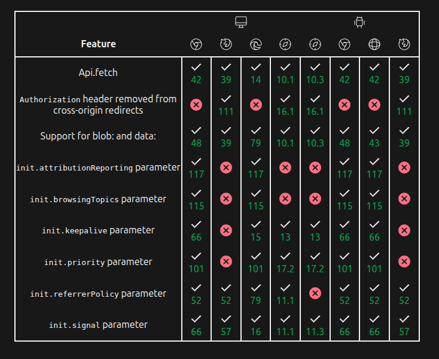
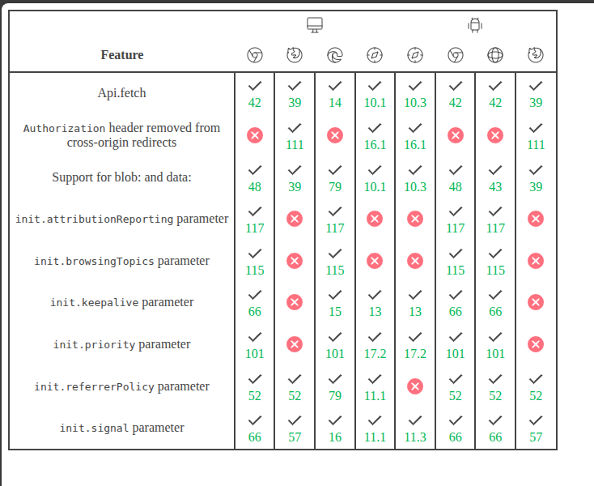
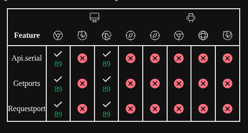

# bcd-table

A Cloudflare Worker that generates an HTML table displaying browser compatibility data for web APIs, sourced from MDN's Browser Compat Data (BCD).

## Screenshots

Appearance with `style=true`


Default Appearnace with `style=false` (follows user-prefers-color-scheme)


Default Appearance (darkmode) embedded in my website

## Why use it?

This service provides a quick way to generate and embed browser compatibility tables for any given web API feature. Being a serverless function, it is fast and efficient. It's useful for documentation, blogs, or any web content where you need to display up-to-date browser support information.

## Architecture

The project is a Cloudflare Worker written in TypeScript.

-   **`src/index.ts`**: The main entry point for the worker. It parses the incoming request, fetches the relevant data from the `@mdn/browser-compat-data` package, and renders an HTML table.
-   **`wrangler.toml`**: Configuration file for the Cloudflare Worker.
-   **`package.json`**: Defines project scripts and dependencies.

The worker takes a query parameter, looks up the API in the BCD dataset, and returns an HTML table showing support across major desktop and mobile browsers.

## Usage

The worker is accessed via a URL with a query parameter specifying the API path from the BCD dataset.

### Query Parameters

-   `key` (required): The API path to look up (e.g., `api.fetch`, `css.properties.display`).
-   `style` (optional): If set to `true`, it includes CSS for a dark-themed presentation suitable for standalone viewing.
-   `reportSize` (optional): If set to `true`, it includes a script to communicate the table's dimensions, useful for embedding in an `iframe`.

### Embedding with `iframe`

When embedding the table in another page using an `iframe`, the `reportSize` option can be used to automatically resize the `iframe` to fit the content.

1.  Add `reportSize=true` to the `src` URL of your `iframe`.
2.  Add a script to the parent page to listen for the `message` event from the `iframe` and resize it accordingly.

**Example `iframe` HTML:**

```html
<iframe src="https://<your-worker-url>/?key=api.fetch&reportSize=true" style="border: none; width: 100%;"></iframe>
```

**Example JavaScript for the parent page:**

```javascript
window.addEventListener("message", (event) => {
  // Find the iframe that sent the message
  const iframe = Array.from(document.querySelectorAll("iframe")).find(
    (iframe) => iframe.contentWindow === event.source
  );

  if (iframe && event.data.type === "resize") {
    iframe.style.height = `${event.data.height}px`;
  }
});
```

### Examples

-   **Get compatibility for the Fetch API:**
    `https://<your-worker-url>/?key=api.fetch`

-   **Get compatibility for the `display` CSS property with full styling:**
    `https://<your-worker-url>/?key=css.properties.display&style=true`

## Deployment

To deploy this worker, you need a Cloudflare account and the Wrangler CLI.

1.  **Install dependencies:**
    ```sh
    bun install
    ```
    or
    ```sh
    npm install
    ```

2.  **Deploy to Cloudflare:**
    ```sh
    bun run deploy
    ```
    or
    ```sh
    npm run deploy
    ```

This will publish the worker to your Cloudflare account.
